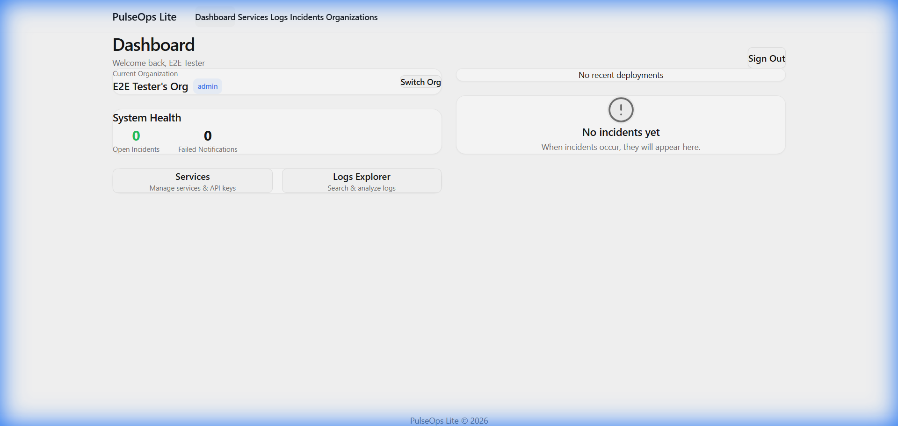

# PulseOps Lite

[](https://github.com/prudhvi1519/pulseops-lite/actions/workflows/ci.yml)
[](https://pulseops-lite.vercel.app)
[](https://github.com/prudhvi1519/pulseops-lite)

**PulseOps Lite** is a lightweight, multi-tenant observability and incident management platform built for modern engineering teams. It provides log ingestion, automated alert rules, and incident tracking in a clean, developer-centric UI.

**Live Demo**: [https://pulseops-lite.vercel.app](https://pulseops-lite.vercel.app)

---

## Table of Contents
*   [Overview](#overview)
*   [Screenshots](#screenshots)
*   [Features](#features)
*   [Tech Stack](#tech-stack)
*   [Quickstart](#quickstart)
*   [Architecture](#architecture)
*   [API Endpoints](#api-endpoints)
*   [Scheduling](#scheduling)
*   [Security](#security)
*   [Diagnostics](#diagnostics)
*   [Deployment](#deployment)
*   [Troubleshooting](#troubleshooting)
*   [Related Documentation](#related-documentation)

---

## Overview
PulseOps Lite solves the "observability gap" for small teams who need robust logging and alerting without the enterprise price tag of Datadog or Splunk. It runs entirely on free-tier infrastructure (Vercel Hobby + Neon/Supabase).

## Screenshots

*Real-time dashboard showing logs and recent incidents.*

## Features
*   **Multi-Tenant**: Support for multiple organizations with role-based access.
*   **Log Ingestion**: High-volume log ingestion via HTTP API.
*   **Automated Rules**: Real-time evaluation of error rates and deployment failures.
*   **Incident Tracking**: Full lifecycle management (Open -> Investigating -> Resolved) with audit trails.
*   **Cron Workflows**: Reliable background processing for alerts and cleanup.
*   **Diagnostics**: Admin-only health dashboard for system maintenance.

## Tech Stack
*   **Framework**: Next.js 15 (App Router, Server Actions)
*   **Language**: TypeScript
*   **Database**: PostgreSQL
*   **Styling**: Tailwind CSS
*   **Deployment**: Vercel
*   **Cron**: Hybrid (Vercel Native + External)

## Quickstart

Get running in minutes locally:

```bash
# 1. Clone
git clone https://github.com/prudhvi1519/pulseops-lite.git
cd pulseops-lite

# 2. Install
pnpm install

# 3. Setup Env
# Copy example and fill in POSTGRES_URL, INTERNAL_CRON_SECRET, etc.
cp .env.example .env.local

# 4. Run
pnpm dev
```

## Architecture
PulseOps Lite uses a serverless architecture optimized for Vercel.
*   **Ingest**: `POST /api/v1/logs` writes directly to Postgres.
*   **Processing**: Scheduled jobs (`evaluator`, `notifier`) run periodically to checking for alert conditions.
*   **UI**: Reactive dashboard built with Next.js Server Components.

## API Endpoints

### Ingestion
*   `POST /api/v1/logs`: Ingest application logs.

### Internal Cron Proxies (Protected)
These endpoints are designed to be triggered by an external scheduler (e.g., cron-job.org).
*   `POST /api/internal/cron/notifications`
*   `POST /api/internal/cron/evaluate`
*   `POST /api/internal/cron/cleanup`

**Authentication**:
Requires custom header:
`x-internal-cron-secret: <INTERNAL_CRON_SECRET>`

## Scheduling
To bypass Vercel Hobby's "daily limit", we use a hybrid approach:

1.  **Daily Jobs**: Handled by **Vercel Cron** (`vercel.json`) for cleanup tasks.
2.  **Frequent Jobs (Every 10m)**: Handled by **External Cron** (cron-job.org) hitting the proxy endpoints.

See [EXTERNAL_CRON_SETUP.md](./EXTERNAL_CRON_SETUP.md) for configuration details.

## Security
*   **No Query Secrets**: Secrets are never passed in the URL.
*   **Header Auth**: Strict enforcement of `x-internal-cron-secret` header.
*   **POST Only**: Cron endpoints reject all other methods.
*   **Environment Variables**: All secrets stored in `.env`.

See [SECURITY_WARNING.md](./SECURITY_WARNING.md) for policy details.

## Diagnostics
Admins can view system health at `/diagnostics`.
*   Shows last run status for all cron jobs.
*   Lists execution history and errors.

## Deployment
1.  Push to GitHub.
2.  Connect to Vercel.
3.  Add Environment Variables.
4.  Configure External Cron (for 10m jobs).

## Troubleshooting
*   **Cron 401/405**: Check `x-internal-cron-secret` header and ensure method is `POST`.
*   **Vercel Deployment Error**: Ensure you didn't add frequent schedules to `vercel.json` (max 1/day).

## Related Documentation
*   [EXTERNAL_CRON_SETUP.md](./EXTERNAL_CRON_SETUP.md)
*   [SECURITY_WARNING.md](./SECURITY_WARNING.md)
*   [VERCEL_LIMITS.md](./VERCEL_LIMITS.md)
